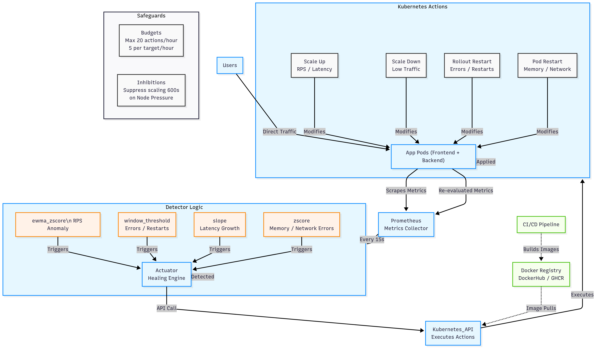

# Self-Healing Kubernetes Framework

## System Architecture

---

## System Design of Self-Healing Kubernetes Framework

### 1. Overview
The proposed system is a self-healing Kubernetes framework that autonomously detects anomalies in application workloads and performs corrective actions without manual intervention. The design follows a closed feedback control loop, where metrics are collected, analyzed, anomalies are detected, and healing actions are executed automatically.  

The system ensures resilience by combining metric-driven anomaly detection, policy-based action execution, and built-in safeguards to prevent cascading failures.

---

### 2. Core Components

#### a) Application Pods
- Frontend and backend services are deployed as Kubernetes pods.  
- These pods directly serve user traffic.  
- Pods form the primary workload of the system and are the central target of healing actions.  

#### b) Metrics Collection (Prometheus)
Prometheus continuously scrapes metrics from application pods and the Kubernetes environment every 15 seconds.  

Metrics monitored include:
- **Traffic (RPS)** → Request rate per second.  
- **Error Rate (5xx codes)** → Identifies failing requests.  
- **Latency (p95)** → Captures user-perceived performance degradation.  
- **Memory Usage** → Detects memory leaks or excessive consumption.  
- **Pod Restarts / OOM Kills** → Identifies instability in workloads.  
- **Node Pressure** → Detects resource exhaustion at the cluster level.  
- **Network Errors** → Captures packet-level anomalies.  

#### c) Detector (Anomaly Detection Engine)
The detector analyzes metrics against baselines using multiple statistical methods:
- **ewma_zscore** → Detects request rate anomalies (traffic surge/drop).  
- **window_threshold** → Flags persistent error rates, restarts, or node pressure.  
- **slope** → Identifies latency growth trends.  
- **zscore** → Detects deviations in memory and network usage.  

Anomalies are confirmed only when thresholds are breached for consecutive intervals, reducing false positives.  

#### d) Actuator (Healing Engine)
On anomaly detection, the actuator triggers healing actions via an API endpoint:  
`http://actuator.selfheal.svc.cluster.local:8080`

Supported actions include:
- **Scale Up** → Add replicas during high traffic or latency spikes.  
- **Scale Down** → Reduce replicas when traffic is low.  
- **Rollout Restart** → Restart deployments upon high error rates, frequent restarts, or node-level issues.  
- **Pod Restart** → Restart individual pods affected by memory leaks or network anomalies.  

#### e) Kubernetes API
- The actuator interacts with the **Kubernetes API**, which executes the requested scaling or restart operations.  
- This creates a closed feedback loop between workload metrics, anomaly detection, and healing actions.  

#### f) Docker Registry (Standalone Block)
- A CI/CD pipeline builds container images and pushes them to a registry (e.g., DockerHub or GHCR).  
- Kubernetes pulls images from the registry during:
  - Pod rescheduling.  
  - Deployment rollouts.  
  - Restarts initiated by healing actions.  

This ensures that the latest stable build is always available.  

#### g) Safeguards
To prevent excessive or conflicting actions, the system enforces safeguards:
- **Budgets** → Max 20 healing actions/hour (5 per target/hour).  
- **Inhibitions** → Suppresses scaling for 600s when node pressure is detected (avoids overloading an already stressed node).  

---

### 3. Feedback Loop
1. Users send requests to application pods.  
2. Prometheus scrapes metrics and forwards them to the detector.  
3. Detector identifies anomalies using statistical models.  
4. Actuator triggers appropriate healing actions.  
5. Kubernetes API executes actions on pods.  
6. Healing is applied → metrics are re-evaluated → loop continues.  

This feedback-driven design ensures continuous monitoring, detection, and correction, achieving resilience with minimal manual intervention.  

---

### 4. Key Advantages
- **Autonomous healing** → Reduces downtime and operator intervention.  
- **Multi-metric anomaly detection** → Improves accuracy over single-threshold systems.  
- **Reusable registry integration** → Ensures consistent recovery with reliable container images.  
- **Safeguards** → Prevents over-correction and cascading failures.  
